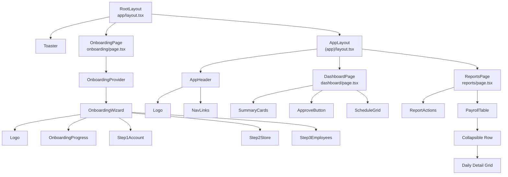

# 컴포넌트 구조 분석 및 개선 제안

## 1. 개요

이 문서는 `studio` 프로젝트의 현재 React 컴포넌트 구조를 분석하고, 효율성 및 향후 개선 가능성을 진단한 결과를 기술합니다. 프로젝트는 **Next.js 15 (App Router)** 기반으로 구축되어 있으며, 기능별로 명확한 디렉토리 구조를 따르고 있습니다.

## 2. 컴포넌트 트리 시각화 (Mermaid)

## 3. 구조 및 효율성 분석

### 3.1 구조적 특징
*   **Layout Pattern**: 
    *   `RootLayout`: 전역 폰트(`Inter`, `PT Sans`)와 `Toaster`를 설정하여 일관된 스타일과 피드백 메커니즘을 제공합니다.
    *   `AppLayout`: 인증된 사용자가 접근하는 영역(`(app)`)에만 상단 네비게이션(`AppHeader`)을 적용하여, 온보딩 화면과 레이아웃을 명확히 분리했습니다.
*   **Atomic Design (유사 패턴)**:
    *   `components/ui`: Shadcn UI 기반의 재사용 가능한 원자(Atom) 단위 컴포넌트들이 잘 모듈화되어 있습니다.
    *   `components/layout`: 헤더, 로고 등 전역 레이아웃 컴포넌트가 분리되어 있습니다.
    *   Feature Components: 각 페이지(`dashboard`, `reports`, `onboarding`) 하위에 `components` 폴더를 두어, 해당 페이지에서만 쓰이는 비즈니스 로직 컴포넌트를 응집도 높게 관리하고 있습니다.

### 3.2 상태 관리 (State Management)
*   **Onboarding (Context API)**:
    *   `OnboardingProvider`를 사용하여 다단계 폼(Wizard)의 데이터를 전역적으로 관리합니다. 이는 단계 간 데이터 지속성을 보장하고 prop drilling을 방지하는 효율적인 패턴입니다.
*   **Dashboard (Local State)**:
    *   `useState`를 사용하여 데이터와 로딩 상태를 관리합니다. 현재는 Mock 데이터를 사용하므로 적절하지만, 실제 API 연동 시 데이터 동기화 복잡도가 증가할 수 있습니다.

### 3.3 렌더링 전략 (Server vs Client)
*   **Client Component 활용**:
    *   `DashboardPage`, `OnboardingPage`, `PayrollTable` 등 인터랙션이 많은 컴포넌트는 `"use client"`를 명시하여 Client Side Rendering을 수행합니다.
    *   `ReportsPage`와 같은 상위 페이지는 기본 Server Component로 동작하려 하나, 하위 컴포넌트의 의존성에 따라 결정됩니다. 현재 구조는 인터랙션이 필요한 잎새(Leaf) 노드 위주로 Client Component로 전환하는 Next.js 권장 패턴을 잘 따르고 있습니다.

## 4. 개선 가능성 및 제안

### 4.1 단기 개선 사항 (Refactoring)
1.  **데이터 Fetching 추상화**:
    *   현재 `DashboardPage` 내부에 `setTimeout`으로 하드코딩된 데이터 로딩 로직이 있습니다. 이를 Custom Hook(예: `useScheduleData`)으로 분리하면 UI와 데이터 로직을 분리하여 가독성을 높일 수 있습니다.
2.  **매직 넘버/스트링 제거**:
    *   `mock-data.ts`에 정의된 데이터 외에, 컴포넌트 내부에 하드코딩된 라벨이나 설정값들을 상수 파일(`constants.ts`)로 분리하는 것을 권장합니다.

### 4.2 장기 아키텍처 제안 (Scalability)
1.  **서버 상태 관리 도입**:
    *   Firebase 연동 시 `React Query` (TanStack Query) 도입을 고려해야 합니다. 현재의 `useState` + `useEffect` 패턴은 캐싱, 재시도, 백그라운드 동기화 등을 직접 구현해야 하므로 비효율적일 수 있습니다.
2.  **Server Actions 활용**:
    *   Next.js 15의 기능을 십분 활용하여, 폼 제출(온보딩 등) 처리를 Client Side API 호출 대신 `Server Actions`로 구현하면 번들 사이즈를 줄이고 보안성을 높일 수 있습니다.
3.  **Compound Component 패턴 적용**:
    *   `PayrollTable`이 다소 복잡해지고 있습니다. 테이블 행, 확장 영역 등을 Compound Component 패턴으로 분리하면 유지보수성이 향상될 것입니다.

## 5. 결론
현재 `studio` 프로젝트는 **Next.js의 App Router 구조를 충실히 따르고 있으며, 컴포넌트의 역할 분리가 명확**합니다. 특히 Shadcn UI를 활용한 일관된 디자인 시스템과 Context API를 적절히 활용한 폼 관리는 초기 프로토타입 이상의 견고함을 보여줍니다. 향후 실제 백엔드 연동 시 데이터 레이어(Data Fetching)만 잘 추상화한다면 확장성 높은 애플리케이션이 될 것입니다.

