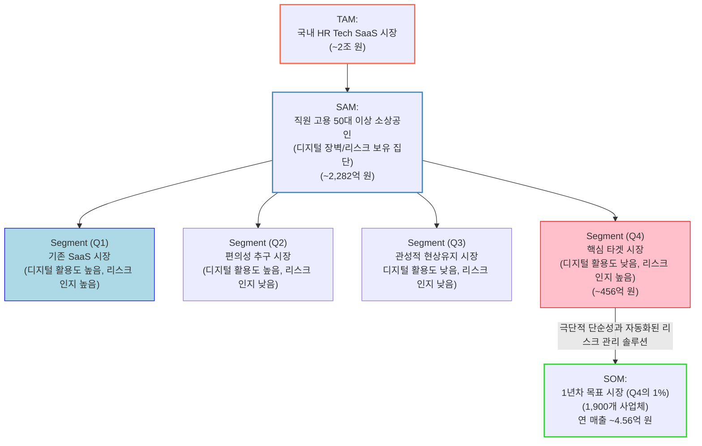

# TAM-SAM-SOM & Market Segment Map

## 1. TAM-SAM-SOM 도식

## 2. 시장 규모 상세 정의

| **구분**            | **작업 단계 대응 (7단계 전략 중)** | **시장 정의**                                                                               | **시장 규모**               | **근거 (대화 내용)**                                                                                                           |
| ------------------------- | ---------------------------------------- | ------------------------------------------------------------------------------------------------- | --------------------------------- | ------------------------------------------------------------------------------------------------------------------------------------ |
| **TAM (전체 시장)** | 1단계: 광범위한 탐색                     | SaaS형 직원 스케줄 관리 서비스가 속한 국내 전체 HR Tech SaaS 시장                                 | 약 2조 원 (연간)                  | 국내 HR Tech 시장이 2025년까지 약 2조 원 규모로 성장할 것을 예측하여 TAM으로 설정함.                                                 |
| **SAM (유효 시장)** | 2단계: 범위 축소                         | '디지털 심리적 장벽'과 '법적 리스크' 문제에 직면한 50대 이상, 직원을 고용한 소상공인              | 약 2,282억 원 (약 95만 개 사업체) | 전체 직원 고용 소상공인(173.5만) 중 50대 이상 비중(54.8%)을 적용하여 산출. (연 24만 원 객단가 기준)                                  |
| **SOM (초기 시장)** | 7단계: 솔루션 구체화                     | SAM 중 리스크 인지 집단(Q4)의 1%를 1년 차 점유 목표로 설정. 솔루션 도입이 시급한 1년 차 목표 집단 | 약 4.56억 원 (1,900개 사업체)     | SAM(Q4) 중 '법적 리스크'를 명확히 인지하고 있어 솔루션 도입이 시급한 1,900개 사업체를 1년 차 목표로 설정. (월 2만 원 구독 모델 기준) |

## 3. Market Segment Map (시장 세분화 지도)

**X축: 법적 리스크 인식 수준 / Y축: 디지털 활용도**

| **구분**                      | **X축: 법적 리스크 인식 수준 (낮음)**                                                                                                                                                                                                                                                                                                           | **X축: 법적 리스크 인식 수준 (높음)**                                                                                                                                                                                                                                                                                                                                                                                                                                                                                                                                                              |
| ----------------------------------- | ----------------------------------------------------------------------------------------------------------------------------------------------------------------------------------------------------------------------------------------------------------------------------------------------------------------------------------------------------- | -------------------------------------------------------------------------------------------------------------------------------------------------------------------------------------------------------------------------------------------------------------------------------------------------------------------------------------------------------------------------------------------------------------------------------------------------------------------------------------------------------------------------------------------------------------------------------------------------------- |
| **Y축: 디지털 활용도 (높음)** | **Q2: 편의성 추구 시장 (Convenience Seekers)**``-**특징:**디지털 활용도는 높지만(앱 사용에 능숙), 법적 리스크(주휴수당 등)의 심각성은 잘 모릅니다.``-**행동:**구글 캘린더, 네이버 캘린더, 혹은 단순 알림 앱 등으로 스케줄을 '편의' 중심으로 관리합니다.``-**결론:**리스크에 대한 '교육'이 선행되어야 하는 잠재 시장입니다. | **Q1: 기존 SaaS 시장 (Existing SaaS Market) (Red Ocean)**``-**특징:**디지털 활용도가 높고, 노동법 리스크도 잘 인지하고 있습니다.``-**행동:**이미 '알밤', '시프티' 같은 기존 SaaS 솔루션을 적극적으로 도입하여 사용 중입니다.``-**결론:**이미 경쟁이 치열한 Red Ocean 시장입니다.                                                                                                                                                                                                                                                                                              |
| **Y축: 디지털 활용도 (낮음)** | **Q3: 관성적 현상유지 시장 (Status Quo Adherents)**``-**특징:**디지털 활용도도 낮고, 법적 리스크에도 둔감합니다.``-**행동:**"지금까지 문제없었다"는 '잘못된 확신' 하에 엑셀/수기 방식을 가장 편하게 생각하며 고수합니다.``-**결론:**변화의 필요성 자체를 느끼지 못해 설득이 가장 어려운 시장입니다.                  | **Q4: 핵심 타겟 시장 (Core Target Market / Trapped) (Blue Ocean)**``-**특징:**법적 리스크의 심각성을 인지하고 있습니다. (예: 직원의 클레임 경험, 세무사의 경고 등) 하지만, 디지털 활용도가 낮아 기존의 복잡한 SaaS 솔루션을 '알아도 쓰지 못합니다'.``-**행동:**불안감 속에서 어쩔 수 없이 엑셀/수기 방식을 사용하며, "누가 대신해줬으면 좋겠다"는 강력한 니즈를 가집니다.``-**결론:**명확한 고통(Pain Point)이 있지만 해결책이 없는 **'고립된 시장(Trapped Market)'**입니다. 우리의 가설("극단적 단순성" + "자동화된 리스크 관리")이 정확하게 파고들어야 할 Blue Ocean입니다. |

## 4. 문제의식-가설 매핑표

| **핵심 문제의식 (Problem)**                                                                                                                                     | **가설 (Hypothesis)**                                                                                                                          | **검증 데이터 (Data / Validation)**                                                                         |
| --------------------------------------------------------------------------------------------------------------------------------------------------------------------- | ---------------------------------------------------------------------------------------------------------------------------------------------------- | ----------------------------------------------------------------------------------------------------------------- |
| **(문제 1) 복잡성으로 인한 '심리적 장벽'**``50대 이상 소상공인은 기존 SaaS가 너무 복잡해 '사회적 수행 불안'을 느끼고 디지털 전환을 포기함.               | **(가설 1) '극단적 단순성' (Less is More)**``솔루션의 기준은 SaaS가 아닌 '엑셀'이 되어야 함. '엑셀보다 쉬워야' 심리적 장벽이 무너짐.    | - 소상공인 **54.8%**가 50대 이상.``- 디지털 전환 실패 사유 1위 '활용 능력 부족'. (중소벤처기업부)          |
| **(문제 2) '숨겨진 리스크' 인식 부재**``엑셀/수기 방식이 유발하는 복잡한 노동법(주휴수당 등) 계산 오류와 법적 리스크(임금체불)의 심각성을 인지하지 못함. | **(가설 2) '자동화된 리스크 관리'**``사장님이 인지하지 못하는 사이, 솔루션이 '알아서' 법적 리스크(주휴수당 등)를 자동 계산/준수해야 함. | - 2024년 상반기 임금체불액 1조 원 돌파.``- 체불 원인: '복잡한 노동법규 무지'. (고용노동부, 소상공인연합회) |
