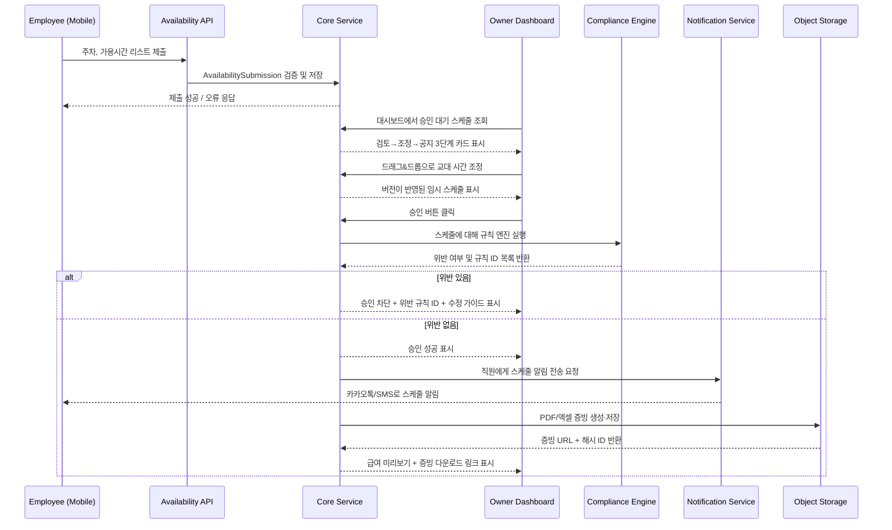
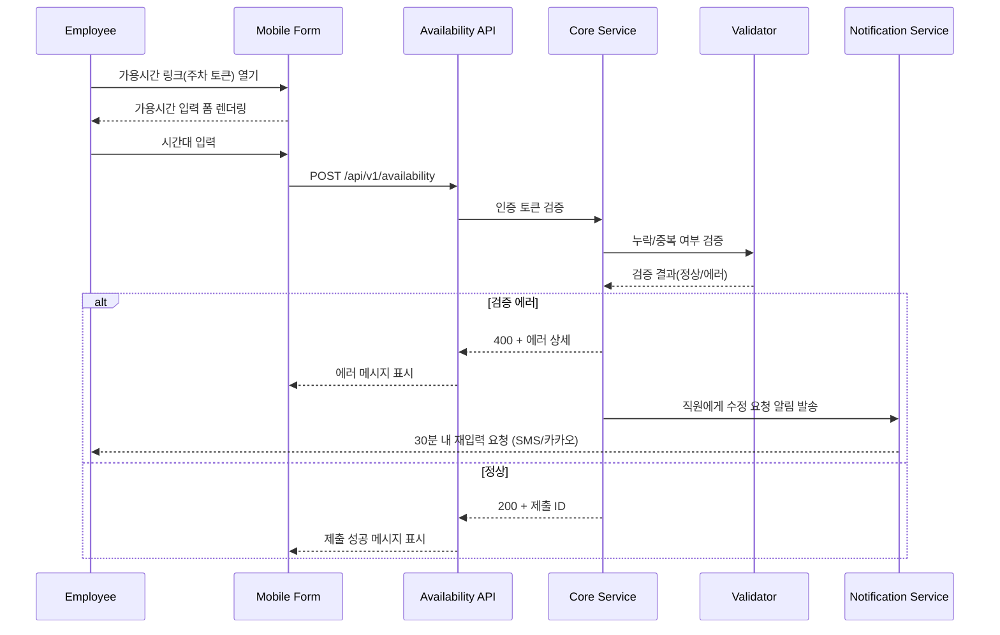
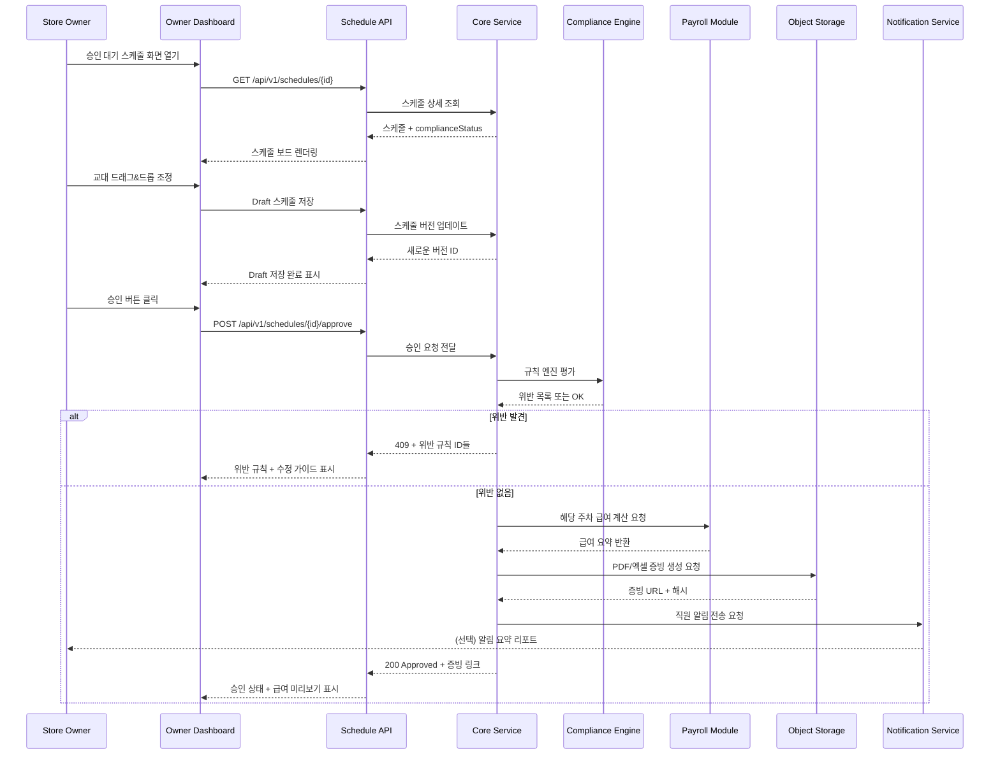

# Software Requirements Specification (SRS)
Document ID: SRS-001  
Revision: 1.0  
Date: 2025-11-14  
Standard: ISO/IEC/IEEE 29148:2018  

-------------------------------------------------

## 0. 이 문서 읽는 법 (기획자·AI 개발용 Easy Guide)

이 문서는 원본 SRS(`GPT-SRS_v0.1.md`)의 **내용·수치·요구사항을 그대로 유지**하면서,  
기획자 관점에서 이해하기 쉽도록 **설명과 가이드 문장만 추가**한 버전이다.

- **이 문서로 할 수 있는 일**
  - AI에게 “백엔드/프론트엔드/API 만들어줘”라고 요청할 때 기준·스펙으로 사용
  - 각 기능(온보딩, 가용시간 제출, 1클릭 승인, 급여 계산 등)이 정확히 **무엇을 해야 하는지** 확인
  - QA나 테스트 케이스를 뽑을 때 **Given/When/Then** 기준으로 사용

- **섹션별 역할 요약**
  - **1. Introduction**: “왜 이 서비스가 필요한지, 어디까지 책임지는지, 어떤 숫자를 맞춰야 하는지” 큰 그림
  - **2. Stakeholders**: 이 시스템과 관련된 “사람들 역할 정리” (사장님/직원/노무사/팀 등)
  - **3. System Context and Interfaces**: “바깥 세계와 어떻게 연결되는지”, 클라이언트·외부시스템·API 개요
  - **4. Specific Requirements**: 가장 중요.  
    - 4.1: 실제 기능 요구사항 (REQ-FUNC-xxx)  
    - 4.2: 성능/보안/비용 같은 품질 기준 (REQ-NF-xxx)
  - **5. Traceability Matrix**: Story ↔ 요구사항 ID 연결 (테스트/티켓 관리에 필요)
  - **6. Appendix**: API 상세·데이터 모델·시퀀스 다이어그램 (AI가 구현할 때 매우 중요)

> **Tip (AI 개발 시):**  
> - “어떤 기능을 만들어야 하는지” → `4.1 Functional Requirements` 테이블을 기준으로 프롬프트에 넣기  
> - “성능/보안 기준” → `4.2 Non-Functional Requirements`를 그대로 붙여 넣기  
> - “API/데이터 구조” → `6.1, 6.2`를 참고해서 AI에게 “이 스키마로 코드 작성”이라고 지시

이제부터 나오는 내용은 **원본 SRS와 동일한 의미**를 가지며,  
섹션마다 한 줄 요약/설명을 추가했을 뿐이다.

-------------------------------------------------

## 1. Introduction

### 1.1 Purpose (목적)

**한 줄 요약:**  
“디지털·노동법에 약한 사장님들을 대신해서, 스케줄과 급여·법규 준수를 자동으로 처리해 주는 SaaS의 설계 기준 문서”

이 Software Requirements Specification(SRS)의 목적은 디지털·노동법에 익숙하지 않은 소규모 사업장(베이커리, 국밥집, 꽃집, 의류 매장 등)을 위한 **SaaS형 직원 스케줄 및 준법 급여 관리 시스템**의 기능·비기능 요구사항을 명확히 정의하는 것이다.  
본 시스템은 다음을 목표로 한다.

- 수당 및 급여 계산 오류를 제거하여 임금체불·과태료 위험을 최소화한다.
- 사장님이 쉽게 스케줄를 만들고, 조정하고, 승인할 수 있도록 한다.
- 주 52시간, 휴게시간, 연속 휴식, 주휴수당 등 **노동법 규정 준수**를 시스템이 자동으로 체크하고, 법적 분쟁에 사용할 수 있는 **증빙 자료**를 자동 생성·보관한다.

본 SRS는 PRD `GPT-PRD.md`를 유일한 비즈니스/기능 요구의 소스로 삼아 작성되며, 개발·QA·운영팀이 설계, 구현, 검증, 유지보수를 수행할 때의 기준 문서이다.

### 1.2 Scope (범위: In-Scope / Out-of-Scope, Assumptions & Constraints)

**한 줄 요약:**  
“이번 1차 버전에서 꼭 만드는 것 / 나중에 미루는 것 / 전제 조건을 명확히 정의”

#### 1.2.1 In-Scope (MVP v1)

MVP v1에서 시스템이 제공해야 하는 범위는 다음과 같다.

- **3단계 온보딩 마법사 (F-01)**  
  - 사장님 회원가입 및 인증  
  - 매장 정보 설정(업종, 영업시간, 대리인 정보 등)  
  - 첫 주간 스케줄 생성까지의 흐름 제공  
  - 신규 매장의 70%가 10분 이내에 온보딩과 첫 스케줄 생성을 완료하는 것을 목표로 한다.

- **직원 가용시간 제출 기능 (F-02)**  
  - 링크 또는 QR 코드로 접근 가능한 모바일 웹 폼 제공  
  - 로그인 없이도 제출 가능하되, 간단한 본인 확인(토큰 등) 수행  
  - 직원·주차 단위로 구조화된 가용시간 데이터를 저장한다.

- **사장님 1클릭 스케줄 승인 및 공지 (F-03, Story 2)**  
  - 사장님 전용 대시보드에 “승인 대기” 카드를 3단계(검토 → 조정 → 공지)로 표시  
  - 한 번의 클릭으로 특정 버전의 스케줄을 확정하는 승인 기능 제공  
  - 승인된 스케줄 또는 변경된 스케줄을 직원에게 **하나의 채널(카카오톡 또는 SMS)** 로 통지

- **노동법 규칙 엔진 및 사전 차단 (F-04, Story 1)**  
  - 주 52시간, 휴게시간, 연속 휴식, 주휴수당, 야간·휴일 근로 등 규칙을 스케줄에 자동 적용  
  - 위반이 존재할 경우 승인 버튼을 비활성화하고, **어떤 규칙을 왜 위반했는지**, 어떻게 수정해야 하는지 가이드를 제공

- **자동 급여/수당 계산 및 증빙 생성 (F-05, Story 1)**  
  - 스케줄/근무 시간 기반으로 기본급과 주휴수당, 연장수당, 야간수당, 휴일수당을 자동 계산  
  - 급여 리포트 및 분쟁 대응용 **PDF/엑셀 증빙 문서** 생성  
  - 각 증빙 문서에 고유 해시값을 부여하고 최소 1년간 보관

- **변경 이력 기록 (Audit Log v1, F-06)**  
  - 스케줄, 규칙, 급여 데이터에 대한 생성/수정/삭제를 모두 로그로 남김  
  - 변경 전/후 값, 수행자, 시각, 디지털 서명(해시) 등을 포함하여 변조 여부를 검출 가능하게 함

- **간단한 리포트 및 인쇄용 화면 (F-07)**  
  - 매장 벽에 붙일 수 있는 형태의 스케줄/급여 요약 화면 제공  
  - 인쇄에 적합한 레이아웃(용지 크기, 여백, 글자 크기 등) 제공

- **알림 및 리마인더 (Story 1 AC4, Story 2 AC2/AC3)**  
  - 입력 누락·중복 등 오류 시 승인 프로세스를 일시 중단하고, 직원에게 수정 요청 알림 발송  
  - 스케줄 확인이 지연되는 직원에게 리마인더, 일정 비율 이상 미확인 시 사장님에게도 알림

- **API 및 인터페이스 (PRD §6)**  
  - 직원 가용시간 제출 API  
  - 스케줄 조회/승인 API  
  - 급여 리포트 조회 API  
  - 노무사 파트너에게 보내는 법규 위반 Webhook  
  - 노무사 전용 법규 규칙 CSV 가져오기/내보내기 인터페이스

#### 1.2.2 Out-of-Scope (MVP v1 제외 범위)

**한 줄 요약:**  
“이번 버전에서 일부러 안 하는 것들을 명시 (기대 조절 + 스코프 관리용)”

다음 기능은 MVP v1에서는 제공하지 않는다(향후 버전에서 고려).

- 한 계정에서 여러 지점(매장)을 통합 관리하는 기능
- 사장/매니저/직원 등 세분화된 RBAC(권한관리) 체계
- 외부 POS 시스템, 급여 솔루션과의 양방향 연동 (F-09)
- 다국어 UI 지원 (영어, 중국어 등)
- AI 기반 스케줄 자동 추천
- SMS/카카오톡 외 이메일, 푸시 알림 등 **복수 채널 동시 사용**

#### 1.2.3 Assumptions & Constraints (가정 및 제약사항)

**한 줄 요약:**  
“이 시스템이 제대로 작동하려면 외부에서 이런 것들이 제공된다고 가정”

- **규제 데이터 제공 가정**  
  - 고용노동부 또는 유관 기관이 노동 규칙 데이터를 월 1회 이상 공개 API 또는 공지 형태로 제공한다고 가정한다.  
  - 노무사 파트너는 법규 변경 시 48시간 이내 검토 메모를 제공한다(ADR-2025-02 참조).

- **인프라 및 데이터 위치 제약**  
  - 데이터 저장·처리는 **국내 리전**에서만 수행되고, 해외 리전은 사용하지 않는다.  
  - 직원 PII는 GDPR 및 국내 법령의 최소 수집 원칙을 준수하며, 직원 1인당 수집 필드는 8개 이하로 제한한다.

- **보안 제약**  
  - 저장 시 모든 PII 및 민감 데이터를 **AES-256**으로 암호화한다.  
  - 클라이언트 및 외부 시스템과의 통신은 **TLS 1.3 이상**만 허용한다.  
  - 규칙 관리·내부 관리자 기능에는 **MFA(다중 인증)** 를 사용한다.

- **운영 의존성**  
  - 카카오톡/SMS 게이트웨이는 99.9% 이상의 가동률을 유지하고, 장애 발생 시 4시간 이내 복구된다고 가정한다.  
  - Datadog, PagerDuty(또는 동등 서비스)가 모니터링·알림에 사용 가능하다.

- **사용자 특성 가정**  
  - 주요 사용자(사장님)는 복잡한 디지털 UI에 익숙하지 않다.  
  - 온보딩과 주요 화면은 단계 수를 최소화하고, 큰 글씨·분명한 색 대비·간단한 선택 흐름으로 설계해야 한다.

### 1.3 Definitions, Acronyms, Abbreviations (용어 정의)

**한 줄 요약:**  
“문서에 나오는 전문 용어를 한 번에 정리한 사전”

| 용어 / 약어             | 정의                                                                                             |
|------------------------|--------------------------------------------------------------------------------------------------|
| **Onboarding (온보딩)**| 회원가입, 매장 설정, 첫 스케줄 생성까지의 초기 설정 과정                                       |
| **Availability (가용시간)** | 직원이 “일할 수 있다”고 표시한 시간대                                                         |
| **Schedule (스케줄)**  | 특정 주차 동안 매장별 직원 근무 배치 계획                                                        |
| **Shift (교대/근무 블록)** | 하루 중 연속된 근무 시간 구간                                                                  |
| **Compliance Rule**    | 노동법상의 제약 조건을 표현한 규칙 엔트리 (예: 주 52시간, 휴게시간, 주휴수당 등)               |
| **Compliance Engine**  | 스케줄에 규칙을 자동 적용하여 위반 여부를 판정하는 엔진                                         |
| **Evidence (증빙)**    | 분쟁·감독 시 제출하는 PDF/엑셀 문서 및 관련 로그                                                |
| **Audit Log**          | 주요 엔터티 변경 기록(누가, 언제, 무엇을, 어떻게 바꿨는지와 서명)을 담는 로그                   |
| **Owner Dashboard**    | 사장님이 스케줄·급여를 관리하는 웹 대시보드                                                      |
| **MVP**                | Minimum Viable Product, 최소 기능으로 가치를 제공하는 첫 버전                                   |
| **MoSCoW**             | Must/Should/Could/Won’t 우선순위 분류 방식                                                      |
| **p90 / p95**          | 응답 시간 등 분포에서 상위 90%/95%가 포함되는 값                                                |
| **SLA**                | Service Level Agreement, 가용성·성능에 대한 합의된 기준                                         |
| **PII**                | 개인 식별 정보                                                                                   |
| **Webhook**            | 특정 이벤트 발생 시 미리 등록된 URL로 HTTP 콜백을 보내는 메커니즘                               |
| **ADR**                | Architecture Decision Record, 중요한 기술 의사결정을 기록한 문서                               |
| **JTBD**               | Jobs To Be Done, 사용자가 달성하려는 “일”을 설명하는 프레임워크                                  |

### 1.4 References (REF-XX)

**한 줄 요약:**  
“이 SRS가 어떤 근거 문서 위에 서 있는지 목록”

| ID     | 제목                                                                                 | 유형              | 위치 / 비고                                                                               |
|--------|--------------------------------------------------------------------------------------|-------------------|------------------------------------------------------------------------------------------|
| REF-01 | SaaS형 직원 스케줄 관리 PRD (`GPT-PRD.md`)                                         | PRD               | 본 SRS의 1차 비즈니스·기능 요구사항 출처                                                 |
| REF-02 | 시장 세그먼트 분석 (`Analysis/6._SaaS_Employee_Schedule_Management_Service_...`)   | 시장 분석         | Q4 타겟 시장 규모 및 디지털 역량 데이터                                                  |
| REF-03 | 페르소나 분석 (`Analysis/7._SaaS_Employee_Schedule_Management_Service_...`)        | 페르소나 리포트   | 페르소나 Pain/Needs 및 자기보고 KPI                                                     |
| REF-04 | 사용자 인터뷰 요약 (`Analysis/9._SaaS_Employee_Schedule_Management_Service_...`)   | 인터뷰 요약       | JTBD 및 오류·시간 관련 정량 지표                                                         |
| REF-05 | 경쟁 분석 (`Analysis/8._SaaS_Employee_Schedule_Management_Service_...`)            | 경쟁사 분석       | AOS/DOS 평가 및 차별 가치                                                                |
| REF-06 | 고용노동부 2024 상반기 임금체불 통계                                               | 정부 통계         | 임금체불액 1조 원 등 규제 위험의 근거                                                   |
| REF-07 | ISO/IEC/IEEE 29148:2018                                                              | 표준              | 시스템·소프트웨어 요구사항 엔지니어링 표준                                              |

-------------------------------------------------

## 2. Stakeholders (이해관계자)

**한 줄 요약:**  
“이 시스템을 쓰거나 영향을 받는 사람들 역할·관심사 정리”

PRD의 페르소나 및 운영 환경을 기반으로 한 이해관계자 정의는 다음과 같다.

| Role ID | 역할 이름                      | 설명 / 대표 페르소나                                                              | 책임(Responsibility)                                                             | 관심사(Interest)                                                                 |
|--------|--------------------------------|------------------------------------------------------------------------------------|----------------------------------------------------------------------------------|----------------------------------------------------------------------------------|
| ST-01  | 매장 사장/운영자               | 베이커리·국밥집·꽃집·의류 매장 등 자영업자                                       | 매장 설정, 스케줄 승인, 준법 여부 모니터링, 급여·분쟁 처리                       | 법규 위반 위험 감소, 스케줄·급여 업무 시간 절감, 직원과의 신뢰 유지             |
| ST-02  | 직원(정규/비정규)              | 가용시간을 제출하고 실제 교대를 수행하는 매장 직원                               | 가용시간 제출, 스케줄 확인, 배정된 교대 준수                                    | 급여의 정확성·제때 지급, 스케줄의 명확성, 불합리한 변경 최소화                 |
| ST-03  | 대리인/Proxy                    | 디지털에 익숙하지 않은 사장님을 대신 지원하는 사람                               | 온보딩·스케줄 관리·승인 등 사장님 업무를 대신 수행                              | 업무 부담 증가 없이 사장님을 지원할 수 있는 단순한 도구                         |
| ST-04  | 노무사(노동법 컨설턴트)        | 노동법 자문 및 규칙 검토를 담당하는 외부 전문가                                  | 규칙 테이블 관리, 위반 알림(Webhook) 수신 시 자문 제공                          | 규칙 최신 상태 유지, 고객의 위반 사례 감소, 과도한 검토 업무 없이 효율적 운영  |
| ST-05  | 프로덕트·운영팀                | 서비스를 기획·운영하는 내부 팀                                                   | 서비스 상태 모니터링, 장애 대응, 온보딩 캠페인, 베타 운영·롤아웃 관리           | 안정적 서비스, 낮은 장애율, 명확한 모니터링, 실험·롤아웃 관리 용이성           |
| ST-06  | 엔지니어링·QA 팀               | 본 SRS를 구현·검증하는 개발·테스트 팀                                            | 아키텍처 설계, 기능 구현, 테스트 작성 및 실행, NFR 만족                         | 테스트 가능한 명확한 요구사항, 추적 가능성, 유지관리·확장 가능한 구조         |

-------------------------------------------------

## 3. System Context and Interfaces (시스템 컨텍스트 및 인터페이스)

**한 줄 요약:**  
“이 서비스가 어떤 외부 시스템·클라이언트와 어떻게 데이터를 주고받는지 큰 그림”

### 3.1 External Systems (외부 시스템)

| ID     | 시스템 이름                     | 설명                                                                                   | 인터페이스 유형               |
|--------|---------------------------------|----------------------------------------------------------------------------------------|------------------------------|
| EXT-01 | 노동법 데이터 제공자            | 고용노동부 등 노동 규정 업데이트를 제공하는 시스템                                    | CSV/API 배치 가져오기        |
| EXT-02 | 카카오톡 / SMS 게이트웨이       | 사장님·직원에게 알림을 발송하기 위한 외부 메시징 서비스                               | HTTPS API (Outbound)         |
| EXT-03 | 오브젝트 스토리지               | 생성된 PDF/엑셀 증빙 및 감사 로그 파일을 저장하는 스토리지                            | 클라우드 스토리지 API        |
| EXT-04 | 모니터링 서비스(Datadog)       | 성능·에러·큐 상태 등을 수집하는 모니터링 시스템                                       | HTTPS API / 에이전트         |
| EXT-05 | 장애관리(PagerDuty)            | SLA·성능 위반 발생 시 알림을 전달하는 장애 관리 시스템                                | HTTPS API / Webhook          |
| EXT-06 | 노무사 도구                     | 법규 위반 Webhook을 수신하여 별도 워크플로우를 수행하는 외부 도구                    | HTTPS Webhook `/events/violation` |

### 3.2 Client Applications (클라이언트 애플리케이션)

| ID    | 클라이언트 이름            | 사용자 유형             | 설명                                                                                  |
|-------|----------------------------|-------------------------|---------------------------------------------------------------------------------------|
| CL-01 | 사장님 웹 대시보드        | 사장/대리인             | 온보딩, 스케줄 관리, 승인, 급여·증빙 조회를 위한 웹 UI                               |
| CL-02 | 직원용 모바일 폼          | 직원                    | 링크/QR을 통해 접근하여 가용시간 제출 및 스케줄 확인에 사용하는 모바일 웹 페이지     |
| CL-03 | 관리자·노무사 콘솔        | 노무사/내부 관리자      | 노동 규칙 CSV 업로드/다운로드 등 규칙 관리 기능을 위한 제한된 웹 UI                  |

### 3.3 API Overview (API 개요)

| API ID | Method | Path                                      | 인증(Auth)       | Rate Limit             | 목적                                                                                       |
|--------|--------|-------------------------------------------|------------------|------------------------|--------------------------------------------------------------------------------------------|
| API-01 | POST   | `/api/v1/availability`                    | Public(토큰 기반)| 분당 30회              | 직원 가용시간 제출 수신                                                                    |
| API-02 | GET    | `/api/v1/schedules/{id}`                  | 인증 필요        | 일반 한도              | 스케줄 상세, 교대 정보, 법규 위반 목록, 승인 상태 조회                                    |
| API-03 | POST   | `/api/v1/schedules/{id}/approve`          | 사장 인증        | 일반 한도              | 스케줄 승인 요청, 규칙 엔진 실행, 직원 알림 트리거                                       |
| API-04 | GET    | `/api/v1/reports/payroll?weekOf=YYYY-WW`  | 사장 인증        | 일반 한도              | 특정 주차의 급여/수당 리포트 및 증빙 파일 링크·고유 번호 조회                             |
| API-05 | POST   | `/events/violation` (Webhook)             | 서명 헤더        | 이벤트 기반            | 중대 법규 위반 발생 시 노무사에게 알림                                                     |
| API-06 | POST   | `/admin/rules/import`                     | 노무사 인증      | 제한                   | 노동 규칙 CSV 업로드·적용                                                                  |
| API-07 | GET    | `/admin/rules/export`                     | 노무사 인증      | 제한                   | 현재 적용 중인 노동 규칙을 CSV로 내보내기                                                 |

### 3.4 Interaction Sequences (핵심 시퀀스 다이어그램)

#### 3.4.1 “가용시간 → 스케줄 승인 → 증빙 생성” 핵심 흐름

-------------------------------------------------

## 4. Specific Requirements (구체 요구사항)

**한 줄 요약:**  
“이 서비스가 반드시 제공해야 하는 동작(기능)과 품질 기준의 리스트 — 개발·QA·AI 프롬프트의 핵심”

### 4.1 Functional Requirements (기능 요구사항)

모든 기능 요구사항은 원자적이고 테스트 가능하며, PRD의 Story/F-기능과 추적 가능해야 한다.  
ID 형식: `REQ-FUNC-xxx`.

| ID           | 제목                                         | 설명                                                                                                         | Source (Story / Feature)              | Priority (MoSCoW) | Acceptance Criteria (Given / When / Then)                                                                                                                                          | Verification Method                          |
|--------------|----------------------------------------------|--------------------------------------------------------------------------------------------------------------|----------------------------------------|-------------------|---------------------------------------------------------------------------------------------------------------------------------------------------------------------------------------------------------------------------|---------------------------------------------|
| REQ-FUNC-001 | 3단계 온보딩 마법사                          | 신규 사장님을 위한 회원가입 → 매장 설정 → 첫 스케줄 생성의 3단계 온보딩 플로우를 제공해야 한다.             | Story 2(사장), F-01                    | Must              | **Given** 신규 사장님이 서비스에 처음 접속했을 때, **When** 온보딩 플로우를 완료하면, **Then** 신규 매장의 70% 이상이 10분 이내에 첫 스케줄을 생성 완료해야 한다.                                   | UX 테스트, 분석 도구를 통한 시간 측정       |
| REQ-FUNC-002 | 매장 정보 수집                               | 온보딩 과정에서 매장 ID, 업종, 영업시간, 대리인 정보를 수집·저장해야 한다.                                  | F-01, PRD §6.1 Store                   | Must              | **Given** 온보딩의 “매장 설정” 단계에서, **When** 필수 필드를 입력하고 저장하면, **Then** 해당 정보가 대시보드·API를 통해 재조회 가능해야 한다.                                                       | API 테스트, DB 스키마 검증                  |
| REQ-FUNC-003 | 직원 등록                                    | 사장님이 직원의 역할, 계약 유형, 시급, 연락처를 등록할 수 있어야 한다.                                      | F-02, PRD §6.1 Employee                | Must              | **Given** 사장님이 직원 추가 화면을 열고, **When** 필수 정보(역할, 계약유형, 시급, 연락처)를 입력·저장하면, **Then** 고유한 직원 ID가 생성되고 매장과 연결되어야 한다.                               | UI 테스트, DB 확인                          |
| REQ-FUNC-004 | 공개 가용시간 제출 API                        | `POST /api/v1/availability` 엔드포인트와 모바일 폼을 통해 직원이 주차별 가용시간을 제출할 수 있어야 한다.   | Story 1, F-02, API-01                  | Must              | **Given** 유효한 직원 토큰과 주차가 주어졌을 때, **When** 모바일 폼을 통해 가용시간을 제출하면, **Then** 시스템은 입력을 검증하고 저장한 후 API 제약 내에서 성공 응답을 반환해야 한다.                   | API 테스트, 모바일 UI 테스트                |
| REQ-FUNC-005 | 가용시간 유효성 및 충돌 검증                  | 동일 직원·동일 주차 내 가용시간 누락·중복을 자동으로 검출해야 한다.                                        | Story 1 AC4, F-02                      | Must              | **Given** 누락 또는 중복된 가용시간이 포함된 제출이 있을 때, **When** 시스템이 이를 처리하면, **Then** 충돌을 표시하고 스케줄 확정 전까지 해당 문제를 해결하도록 요구해야 한다.                        | 단위 테스트, 통합 테스트                    |
| REQ-FUNC-006 | 승인 대기 대시보드                           | 활성 직원의 ≥70%가 가용시간을 제출한 경우, 대시보드에 “검토→조정→공지” 3단계 카드가 표시되어야 한다.        | Story 2 AC1, F-03                      | Must              | **Given** 활성 직원의 70% 이상이 유효한 가용시간을 제출했을 때, **When** 사장님이 대시보드를 열면, **Then** 2초 이내에 3단계 구조의 승인 대기 카드가 렌더링되어야 한다.                                | UI 테스트, 성능 테스트                      |
| REQ-FUNC-007 | 드래그&드롭 스케줄 편집                       | 스케줄 화면에서 교대 시간을 드래그&드롭으로 조정하고, 임시 버전으로 저장할 수 있어야 한다.                 | Story 2 AC2, F-03, PRD §6.1 Schedule   | Should           | **Given** 임시 스케줄이 열려 있을 때, **When** 사장님이 특정 교대를 다른 시간대로 드래그&드롭하면, **Then** 활성 스케줄에는 영향을 주지 않고 신규 버전의 Draft가 저장·재조회 가능해야 한다.              | UI 테스트, 버전 관리 테스트                |
| REQ-FUNC-008 | 1클릭 스케줄 승인                             | 특정 스케줄 버전을 규칙 검증 후 한 번의 승인 액션으로 확정할 수 있어야 한다.                               | Story 2, F-03                           | Must              | **Given** 위반이 없는 Draft 스케줄이 있을 때, **When** 사장님이 “승인” 버튼을 클릭하면, **Then** 스케줄 상태가 “Approved”로 변경되고 읽기 전용이 되며 승인 시각이 기록되어야 한다.                      | 통합 테스트, 상태 전이 검증                 |
| REQ-FUNC-009 | 승인 전 규칙 엔진 평가                        | 모든 승인 요청 전에 스케줄이 노동법 규칙에 대해 자동 평가되어야 한다.                                      | Story 1 AC2, F-04, PRD §6.1 ComplianceRule | Must           | **Given** 교대 정보가 포함된 스케줄이 있을 때, **When** 사장님이 승인 시도를 하면, **Then** 관련 규칙들이 모두 적용되고, 위반 사항이 있으면 반환되어야 한다.                                         | 규칙 엔진 단위 테스트, E2E 테스트          |
| REQ-FUNC-010 | 위반 시 승인 차단 및 가이드 제공              | 위반이 감지되면 승인 버튼을 비활성화하고, 어떤 규칙이 왜 위반되었는지와 수정 가이드를 표시해야 한다.       | Story 1 AC2, F-04                        | Must              | **Given** 예를 들어 주 52시간 초과와 같은 위반이 있는 스케줄에서, **When** 사장님이 “승인”을 클릭하면, **Then** 버튼이 비활성화되고 위반 규칙 ID와 수정 방법이 UI에 표시되어야 한다.                      | UI 테스트, 규칙 엔진 테스트                 |
| REQ-FUNC-011 | 자동 급여·수당 계산                           | 스케줄/근무시간·시급 정보를 바탕으로 기본급, 주휴수당, 연장·야간·휴일 수당을 자동 계산해야 한다.           | Story 1 AC1, F-05                       | Must              | **Given** 승인된 스케줄과 직원별 시급 설정이 있을 때, **When** 특정 주차에 대한 급여 계산을 수행하면, **Then** 직원별로 항목별(기본급, 각 수당) 금액이 산출·표시되어야 한다.                             | 계산 로직 단위 테스트, 회귀 테스트          |
| REQ-FUNC-012 | 급여 미리보기 및 색상 하이라이트              | 급여 미리보기 화면에서 수당 차이 등 주요 변화를 색상으로 한눈에 구분할 수 있어야 한다.                     | Story 1 AC1, F-05                       | Should           | **Given** 급여 미리보기 화면을 열었을 때, **When** 각 항목이 렌더링되면, **Then** 항목별 금액 변화나 차이가 명확한 색상과 범례로 표시되어야 한다.                                                | UI 테스트, UX 리뷰                         |
| REQ-FUNC-013 | PDF/엑셀 증빙 생성                            | 승인된 스케줄·급여 데이터를 기반으로 PDF/엑셀 증빙 문서를 생성·다운로드 링크를 제공해야 한다.              | Story 1 AC3, F-05                       | Must              | **Given** 특정 주차의 급여가 승인되었을 때, **When** 사장님이 증빙 내보내기를 요청하면, **Then** 성능 NFR(5초 이내)을 만족하는 범위에서 PDF/엑셀 다운로드 링크가 제공되어야 한다.                          | 내보내기 단위 테스트, 성능 테스트           |
| REQ-FUNC-014 | 증빙 해시 및 보관                              | 각 증빙 문서에 대해 고유 해시(SHA-256)를 생성하고 최소 1년간 조회 가능하게 보관해야 한다.                 | Story 1 AC3, F-06                       | Must              | **Given** 증빙 파일이 생성될 때, **When** 저장이 완료되면, **Then** SHA-256 해시가 메타데이터와 함께 저장되고, 12개월 동안 검증 및 재다운로드가 가능해야 한다.                                     | 스토리지 테스트, 해시 검증 테스트           |
| REQ-FUNC-015 | 감사 로그(Audit Log)                          | 스케줄, 규칙, 급여 엔터티에 대한 생성·수정·삭제 이벤트를 모두 감사 로그에 남겨야 한다.                     | F-06, PRD §6.1 AuditLog                 | Should           | **Given** 해당 엔터티가 변경될 때, **When** 트랜잭션이 커밋되면, **Then** 수행자, 시각, 변경 전/후 값, 서명을 포함한 로그 엔트리가 작성되어야 한다.                                               | 로그 검증, 단위 테스트                      |
| REQ-FUNC-016 | 직원 스케줄 알림                               | 스케줄 승인 또는 변경 시 해당 직원들에게 설정된 단일 채널(카카오톡 또는 SMS)로 알림을 발송해야 한다.       | Story 2 AC2, F-03                       | Must              | **Given** 스케줄 버전이 승인되었을 때, **When** 영향을 받는 직원이 존재하면, **Then** 15초 이내에 알림 발송을 시도하고, 성공/실패 상태를 기록해야 한다.                                          | 게이트웨이 모킹 통합 테스트                 |
| REQ-FUNC-017 | 직원 리마인더 및 사장님 에스컬레이션           | 승인된 스케줄을 12시간 이상 확인하지 않은 직원에게 리마인더를 보내고, 미확인 비율이 10%를 넘으면 사장님에게도 알려야 한다. | Story 2 AC3         | Should           | **Given** 스케줄이 승인된 상태에서, **When** 12시간이 경과했을 때 일부 직원이 미확인 상태라면, **Then** 해당 직원에게 재알림을 보내고, 미확인 비율이 10% 초과 시 사장님에게 알림을 전송해야 한다.           | 배치/스케줄러 테스트, 분석 검증              |
| REQ-FUNC-018 | 입력 오류 감지 및 승인 프로세스 일시 중단      | 직원 가용시간 입력에 누락·중복 등이 있을 경우 자동으로 감지하고 승인 프로세스를 중단해야 한다.            | Story 1 AC4, F-02                      | Must              | **Given** 직원이 가용시간을 잘못 입력했을 때, **When** 시스템이 이를 감지하면, **Then** 30분 이내에 직원에게 수정 요청 알림을 전송하고, 해당 입력이 정정되기 전까지 승인 절차를 진행할 수 없어야 한다. | 단위 테스트, E2E 테스트                     |
| REQ-FUNC-019 | 법규 위반 Webhook 통지                         | 심각도가 높은 위반이 발생하면 `/events/violation` Webhook을 통해 외부 파트너에게 서명된 이벤트를 전송해야 한다. | PRD §6.2 Webhook, F-04            | Could            | **Given** High severity 규칙 위반이 판정될 때, **When** 규칙 엔진이 결과를 반환하면, **Then** 구성된 Webhook 엔드포인트에 서명된 JSON 페이로드를 POST해야 한다.                                    | Webhook 모킹 테스트                         |
| REQ-FUNC-020 | CSV 기반 법규 규칙 관리                        | 노무사는 CSV 파일을 통해 규칙을 가져오기/내보내기 할 수 있어야 한다.                                        | PRD §6.2 Rule Update, F-04           | Should           | **Given** 유효한 규칙 CSV가 있을 때, **When** 노무사가 관리자 콘솔을 통해 업로드하면, **Then** 각 레코드가 검증·적용되고, 오류 행은 상세 사유와 함께 리포트되어야 한다.                             | CSV 파서 테스트, 관리자 UI 테스트           |
| REQ-FUNC-021 | 인쇄용 리포트                                  | 스케줄·급여 정보를 인쇄-friendly 레이아웃으로 제공해야 한다.                                               | F-07                                   | Could            | **Given** 사장님이 인쇄용 화면을 열었을 때, **When** 브라우저 인쇄 기능을 사용하면, **Then** A4 기준으로 레이아웃 깨짐 없이 출력되어야 한다.                                                     | 시각적 UI 테스트, 수동 인쇄 검증            |

### 4.2 Non-Functional Requirements (비기능 요구사항)

**한 줄 요약:**  
“얼마나 빠르게, 얼마나 안정적으로, 얼마나 안전하게, 얼마의 비용으로 운영할 것인지에 대한 수치 기준”

모든 비기능 요구사항은 측정 가능해야 하며, ID 형식은 `REQ-NF-xxx`를 따른다.

| ID          | 카테고리        | 설명                                                                                 | Metric / Acceptance Criteria                                                                                       | Verification Method                       |
|-------------|-----------------|--------------------------------------------------------------------------------------|--------------------------------------------------------------------------------------------------------------------|------------------------------------------|
| REQ-NF-001  | 성능            | 스케줄 보드 조회 응답 시간                                                           | 사장님이 스케줄 보드 조회 시 p95 응답 시간이 0.8초(800ms) 이하여야 한다.                                          | 부하 테스트, APM 메트릭                  |
| REQ-NF-002  | 성능            | 승인 처리 응답 시간                                                                  | 승인 버튼 클릭부터 승인 완료까지 p95 응답 시간이 1.2초 이하여야 한다.                                             | 부하 테스트, APM 메트릭                  |
| REQ-NF-003  | 성능            | PDF 생성 시간                                                                        | 직원 50명 기준 증빙 PDF 생성 시간이 5초 이하여야 한다.                                                            | 내보내기 성능 테스트                     |
| REQ-NF-004  | 신뢰성          | 서비스 가용성                                                                       | 한 달 기준 서비스 가용성이 99.5% 이상(다운타임 월 3.6시간 이하)이어야 한다.                                       | 가용성 모니터링, 장애 리포트             |
| REQ-NF-005  | 신뢰성          | 규칙 엔진 오류율                                                                    | 규칙 엔진 실행 중 시스템 오류율이 0.2% 이하이며, 일시적 오류 시 자동 재시도를 수행해야 한다.                      | 에러 로그 분석, 스트레스 테스트          |
| REQ-NF-006  | 신뢰성          | 알림 전송 성공률                                                                    | SMS/카카오 알림의 월간 전송 성공률이 97% 이상이어야 한다.                                                         | 게이트웨이 리포트, 모니터링              |
| REQ-NF-007  | 보안            | 저장 데이터 암호화                                                                  | 모든 PII 및 민감한 급여 데이터는 AES-256으로 암호화된 상태로 저장되어야 한다.                                     | 보안 감사, 구성 점검                     |
| REQ-NF-008  | 보안            | 전송 구간 암호화                                                                    | 모든 외부 HTTP 엔드포인트는 TLS 1.3 이상만 허용하고, HTTP 요청은 차단 또는 HTTPS로 리다이렉트해야 한다.           | 모의 침투 테스트, 설정 검증             |
| REQ-NF-009  | 보안            | 데이터 국외 반출 금지                                                               | 모든 데이터 저장·처리는 국내 리전에서만 수행되고, 해외 리전 사용이 없어야 한다.                                   | 클라우드 인프라 검토, 데이터 위치 리포트 |
| REQ-NF-010  | 보안            | PII 최소 수집                                                                       | 직원 1인당 PII 필드는 데이터 모델에 정의된 8개 이하로 제한되어야 한다.                                            | 데이터 모델 리뷰, DB 스키마 점검        |
| REQ-NF-011  | 보안            | 관리자·규칙 관리 접근 제어                                                          | 규칙 관리·내부 관리자 기능은 인증된 계정과 MFA를 통해서만 접근 가능해야 한다.                                     | 접근 제어 테스트, 보안 감사              |
| REQ-NF-012  | 비용            | 매장당 월 운영 비용                                                                 | 활성 매장 1곳당 평균 월 운영 비용이 3,000원 이하를 유지해야 한다.                                                 | 비용 모니터링, 재무 리포트               |
| REQ-NF-013  | 모니터링        | 실시간 모니터링 범위                                                                | Datadog 대시보드에 API 응답 시간, 규칙 엔진 실패, 알림 큐 깊이가 실시간에 가깝게 표시되어야 한다.                | 대시보드 점검, 모니터링 설정 테스트      |
| REQ-NF-014  | 모니터링        | 알림 임계값                                                                         | API p95 응답 시간이 1.2초를 초과하는 상태가 5분 이상 지속될 경우, 심야 포함 PagerDuty 알림이 발생해야 한다.     | 알림 시뮬레이션, 장애 대응 훈련          |
| REQ-NF-015  | 확장성          | 매장 수 확장성                                                                      | 최소 60개 매장(베타 샘플)을 동시에 운영해도 REQ-NF-001–003 성능 기준을 만족해야 한다.                             | 60개 가상 매장 부하 테스트               |
| REQ-NF-016  | 유지보수성      | 규칙 변경 반영 리드타임                                                             | 노무사가 제공한 신규/변경 규칙은 수신 후 2주 이내에 프로덕션에 배포 가능해야 한다.                               | 변경 관리 기록, 릴리즈 로그              |
| REQ-NF-017  | 유지보수성      | 핫픽스 가능성                                                                       | REQ-NF-001, 004, 006을 위반하는 치명적 이슈는 서비스 중단 없이 핫픽스로 배포 가능해야 한다(예: 블루/그린).       | 배포 시나리오 테스트, 롤백 테스트        |

-------------------------------------------------

## 5. Traceability Matrix (추적성 매트릭스)

**한 줄 요약:**  
“각 Story가 어떤 REQ-FUNC / REQ-NF와 연결되는지 요약 — 테스트/티켓 시스템과 연결할 때 사용”

Story–Requirement–Test Case 간의 상위 매핑은 다음과 같다.

| Story ID   | Story 설명                                    | 관련 요구사항                                              | 예시 Test Case ID                                  |
|-----------|-----------------------------------------------|------------------------------------------------------------|----------------------------------------------------|
| ST-Story-1 | 준법 급여 운영 (Story 1 — Lawful Payroll)    | REQ-FUNC-004, 005, 009–015, 018–020; REQ-NF-001–007        | TC-001(가용시간 제출), TC-010(위반 차단), TC-020(급여 계산), TC-030(증빙 해시) |
| ST-Story-2 | 1클릭 스케줄 승인 (Story 2 — 1-click Approve)| REQ-FUNC-001, 006–008, 016–017; REQ-NF-001–006             | TC-040(승인 대기 카드), TC-050(드래그&드롭), TC-060(승인 속도), TC-070(알림·리마인더) |

각 REQ-FUNC / REQ-NF와 구체 Test Case ID 간의 상세 매핑은 별도의 테스트 관리 도구에서 `Requirement ID` 필드를 통해 관리한다.

-------------------------------------------------

## 6. Appendix (부록)

**한 줄 요약:**  
“AI가 실제 구현할 때 바로 써먹는 API 목록, 데이터 구조, 상세 시퀀스”

### 6.1 API Endpoint List

| API ID | Method | Path                                      | 요청 스키마(요약)                                              | 응답(요약)                                                              | 관련 요구사항                          |
|--------|--------|-------------------------------------------|-----------------------------------------------------------------|-------------------------------------------------------------------------|----------------------------------------|
| API-01 | POST   | `/api/v1/availability`                    | 직원 토큰, 주차(YYYY-WW), [요일, 시작, 종료] 리스트            | 성공 여부, 검증 에러 목록(있을 경우)                                    | REQ-FUNC-004, 005, 018; REQ-NF-001     |
| API-02 | GET    | `/api/v1/schedules/{id}`                  | 스케줄 ID                                                       | 교대 리스트, 법규 위반 목록, 승인 상태                                  | REQ-FUNC-006–008, 009; REQ-NF-001–002  |
| API-03 | POST   | `/api/v1/schedules/{id}/approve`          | 조정 사항 리스트(선택), 알림 채널                              | 승인 결과, 위반 목록(있을 경우), 알림 요약                              | REQ-FUNC-007, 008, 009, 010, 016; REQ-NF-002 |
| API-04 | GET    | `/api/v1/reports/payroll?weekOf=YYYY-WW`  | 주차, 선택적 매장 ID                                            | 직원별 급여·수당 상세, 증빙 파일 링크, 고유 해시 ID                     | REQ-FUNC-011–014; REQ-NF-003           |
| API-05 | POST   | `/events/violation` (Webhook)             | 매장, 스케줄, 규칙 ID, 심각도 등을 포함한 위반 이벤트          | 외부 시스템의 2xx ACK                                                    | REQ-FUNC-019; REQ-NF-005               |
| API-06 | POST   | `/admin/rules/import`                     | ComplianceRule CSV 파일                                         | 생성/수정/실패 행 수와 실패 사유를 포함한 요약                          | REQ-FUNC-020; REQ-NF-016               |
| API-07 | GET    | `/admin/rules/export`                     | 선택적 필터 파라미터                                            | 현재 ComplianceRule 레코드를 담은 CSV 스트림                            | REQ-FUNC-020                           |

### 6.2 Entity & Data Model (엔터티 및 데이터 모델)

다음 표는 논리적 수준의 데이터 모델을 정의한다.

#### 6.2.1 Store

| 필드 이름      | 타입        | 설명                               | 비고                     |
|----------------|------------|------------------------------------|--------------------------|
| id             | UUID/String| 매장 고유 ID                       | PK                       |
| name           | String     | 매장 이름                          |                          |
| businessType   | Enum       | 업종(베이커리, 음식점, 소매 등)    |                          |
| openingHours   | JSON/Struct| 요일별 영업시간                    |                          |
| ownerId        | UUID/String| 사장님 사용자 ID                   |                          |
| delegateInfo   | JSON/Struct| 대리인 연락처 정보                 | 선택                     |
| createdAt      | DateTime   | 생성 시각                          |                          |
| updatedAt      | DateTime   | 마지막 수정 시각                   |                          |

#### 6.2.2 Employee

| 필드 이름        | 타입        | 설명                               | 비고                                      |
|------------------|------------|------------------------------------|-------------------------------------------|
| id               | UUID/String| 직원 고유 ID                       | PK                                        |
| storeId          | UUID/String| 소속 매장 ID                       | FK → Store.id                             |
| name             | String     | 직원 이름                          | 가명 처리 가능                            |
| role             | Enum       | Owner / Staff / Manager           |                                          |
| contractType     | Enum       | 정규 / 비정규                      |                                          |
| hourlyWage       | Decimal    | 시급                               |                                          |
| contactChannel   | Enum       | KakaoTalk / SMS                    |                                          |
| contactIdentifier| String     | 전화번호 또는 카카오 ID           | PII, 저장 시 암호화                       |
| createdAt        | DateTime   | 생성 시각                          |                                          |
| updatedAt        | DateTime   | 마지막 수정 시각                   |                                          |

#### 6.2.3 AvailabilitySubmission

| 필드 이름        | 타입        | 설명                                          | 비고                            |
|------------------|------------|-----------------------------------------------|---------------------------------|
| id               | UUID/String| 제출 고유 ID                                  | PK                              |
| employeeId       | UUID/String| 직원 ID                                       | FK → Employee.id                |
| weekOf           | String     | 주차 (YYYY-WW)                                |                                 |
| timeRanges       | JSON/Struct| [요일, 시작시간, 종료시간] 리스트             |                                 |
| submissionChannel| Enum       | Kakao / Phone / App / Web                     |                                 |
| submittedAt      | DateTime   | 제출 시각                                     |                                 |

#### 6.2.4 Schedule

| 필드 이름       | 타입        | 설명                                           | 비고                                  |
|-----------------|------------|-----------------------------------------------|---------------------------------------|
| id              | UUID/String| 스케줄 ID                                      | PK                                    |
| storeId         | UUID/String| 매장 ID                                       | FK → Store.id                         |
| weekOf          | String     | 주차 (YYYY-WW)                                |                                       |
| status          | Enum       | Draft / Approved / Archived                  |                                       |
| approvedBy      | UUID/String| 승인자(사장/대리인) ID                        | Draft 상태인 경우 NULL                |
| approvedAt      | DateTime   | 승인 시각                                     |                                       |
| version         | Integer    | 버전 번호                                     | 변경 시마다 증가                      |
| shifts          | JSON/Struct| [직원ID, 요일, 시작, 종료] 리스트             |                                       |
| complianceStatus| Enum       | Pending / Passed / Violated                  |                                       |

#### 6.2.5 ShiftTemplate

| 필드 이름       | 타입        | 설명                                           | 비고                      |
|-----------------|------------|-----------------------------------------------|---------------------------|
| id              | UUID/String| 템플릿 ID                                     | PK                        |
| storeId         | UUID/String| 매장 ID                                       | FK → Store.id             |
| weekday         | Enum       | 요일                                          |                           |
| defaultRuleId   | UUID/String| 기본 적용 규칙 ID                             | FK → ComplianceRule.id    |
| defaultStartTime| Time       | 기본 시작 시간                                |                           |
| defaultEndTime  | Time       | 기본 종료 시간                                |                           |

#### 6.2.6 ComplianceRule

| 필드 이름      | 타입        | 설명                                           | 비고                   |
|----------------|------------|-----------------------------------------------|------------------------|
| id             | UUID/String| 규칙 ID                                       | PK                     |
| code           | String     | 규칙 코드 (예: LAW-52H-WEEK)                  |                        |
| lawReference   | String     | 관련 법 조항                                  |                        |
| formula        | String/JSON| 계산 공식 또는 파라미터                       |                        |
| effectiveFrom  | Date       | 발효일                                        |                        |
| severity       | Enum       | Low / Medium / High                           |                        |
| description    | String     | 사람 읽기용 설명                              |                        |

#### 6.2.7 AuditLog

| 필드 이름      | 타입        | 설명                                           | 비고                               |
|----------------|------------|-----------------------------------------------|------------------------------------|
| id             | UUID/String| 로그 ID                                       | PK                                 |
| entityType     | String     | 엔터티 타입(Schedule, Payroll, ComplianceRule)|                                     |
| entityId       | UUID/String| 대상 엔터티 ID                                |                                     |
| action         | Enum       | Create / Update / Delete                      |                                     |
| actorId        | UUID/String| 수행자 ID                                     |                                     |
| beforeValue    | JSON/Struct| 변경 전 스냅샷                                | 생성(Create) 시 선택               |
| afterValue     | JSON/Struct| 변경 후 스냅샷                                |                                     |
| hashSignature  | String     | SHA-256 서명                                  | 변조 방지용                         |
| createdAt      | DateTime   | 로그 생성 시각                                |                                     |

### 6.3 Detailed Interaction Models (상세 시퀀스 다이어그램)

#### 6.3.1 가용시간 제출 및 충돌 처리 상세 흐름

#### 6.3.2 스케줄 승인·규칙 검증·증빙 생성 상세 흐름

