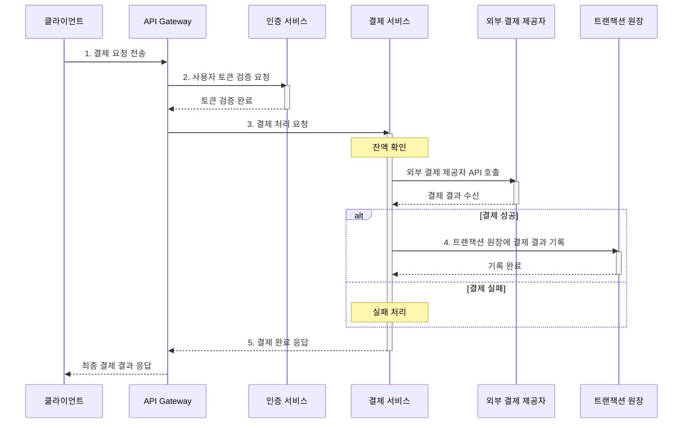

# PRD를 SRS로 확장하기

## 1. SRS 란?

: Agentic Programming 을 위한 Software Requirements 의 핵심 파악

* **Functional Requirements (기능 요구사항)**
  * "시스템이 무엇을 해야 하는가?"
* **Non-Functional Requirements (비기능 요구사항)**
  * "시스템이 얼마나 잘 수행해야 하는가?" (성능/보안/비용)

---

### 예시: 쇼핑몰 서비스 요구사항 (구식 포맷이지만 단순해서 비교에 좋음)

* **Functional Requirements**

| ID    | 요구사항 설명                                                         |
| :---- | :-------------------------------------------------------------------- |
| FR-01 | 시스템은 사용자가 이메일과 비밀번호로 회원가입할 수 있도록 해야 한다. |
| FR-02 | 시스템은 사용자가 로그인하고 세션을 유지할 수 있도록 해야 한다.       |
| FR-03 | 시스템은 카테고리별 상품 목록을 표시해야 한다.                        |
| FR-04 | 시스템은 상세 상품 정보를 조회할 수 있도록 해야 한다.                 |
| FR-05 | 시스템은 사용자가 상품을 장바구니에 담을 수 있도록 해야 한다.         |
| FR-06 | 시스템은 장바구니 내 수량 조절 기능을 제공해야 한다.                  |
| FR-07 | 시스템은 결제 인터페이스를 통해 주문을 완료할 수 있도록 해야 한다.    |
| FR-08 | 시스템은 사용자가 과거 주문 내역을 조회할 수 있도록 해야 한다.        |
| FR-09 | 시스템은 관리자가 상품을 생성, 수정, 삭제할 수 있도록 해야 한다.      |
| FR-10 | 시스템은 관리자가 주문 상태를 변경할 수 있도록 해야 한다.             |

* **Non-Functional Requirements**

| ID     | 요구사항 설명                                                                 |
| :----- | :---------------------------------------------------------------------------- |
| NFR-01 | 시스템은 정상 부하 시 사용자 요청에 1초 이내로 응답해야 한다.                 |
| NFR-02 | 시스템은 최소 1,000명의 동시 사용자 접속을 지원해야 한다.                     |
| NFR-03 | 모든 사용자 비밀번호는 단방향 암호화 방식으로 저장해야 한다.                  |
| NFR-04 | 시스템은 연중무휴 24/7 가용성을 유지하며 99.9% 이상의 업타임을 보장해야 한다. |
| NFR-05 | 모든 트랜잭션은 매 시간마다 백업되며 1시간 내 복구가 가능해야 한다.           |
| NFR-06 | 시스템은 주요 브라우저(Chrome, Edge, Safari, Firefox)를 지원해야 한다.        |
| NFR-07 | UI는 색상 대비와 내비게이션에서 WCAG 2.1 접근성 기준을 충족해야 한다.         |

---

### SRS (Software Requirements Specification) : 글로벌 표준 양식 확인

| 항목                                      | IEEE 830-1998                        | ISO/IEC/IEEE 29148:2018                                                   |
| :---------------------------------------- | :----------------------------------- | :------------------------------------------------------------------------ |
| **발행 연도**                       | 1998                                 | 2011 (2018 개정)                                                          |
| **현재 상태**                       | 폐기됨                               | **사용 중**                                                         |
| **범위**                            | SRS 문서 구조 정의                   | 시스템·소프트웨어 요구사항 엔지니어링 전 라이프 사이클 포괄              |
| **주 목적**                         | SRS 문서 포맷 표준화                 | 요구사항 도출, 분석, 명세, 검증, 관리 통합 가이드                         |
| **요구사항 ID**                     | 필수 아님                            | **모든 요구사항에 ID 부여 필수**                                    |
| **추적성 (Traceability)**           | 명시 없음                            | **요구사항-설계-검증 간 명시적 추적성 요구**                        |
| **검증 방법**                       | 포괄적·짧음                         | Inspection/Test/Analysis/Demonstration 명확 정의                          |
| **승인 기준 (Acceptance Criteria)** | 없음                                 | **각 요구사항마다 반드시 포함**                                     |
| **이해관계자 정의**                 | 별도 섹션 없음                       | **역할과 책임 명확 정의**                                           |
| **비기능 요구사항**                 | 제한적 언급                          | 성능, 보안, 신뢰성 등 품질 속성 상세 정의                                 |
| **문서 구조**                       | 서론, 전체 설명, 구체 요구사항, 부록 | 기획→ 도출 → 명세 → 검증 → 관리 단계별 구성                           |
| **품질 기준**                       | 기초적 수준                          | **요구사항 품질의 상세 기준 제공**                                  |
| **산업 채택도**                     | 학계/레거시 위주                     | **글로벌 프로젝트, 공공 조달, CMMI, ISO 기반 조직에서 광범위 사용** |

→ 실제 표준 양식은 문서화 구조가 매우 정교하고 방대함
⇒ 시작할 때는 적절한 크기의 템플릿으로 점진적으로 확장해 나가는 것이 중요함!

---

### 정확한 설계 문서로 프로그램 로직 상세 가이드 하기

설계 문서는 SRS에 명시할 수 있는 가장 구체적인 시스템적 요구사항!
설계 문서에는 UseCase, ERD, CLD, Component Diagram, Sequence Diagram 등이 있음
AI 에이전트 활용 개발에서는 Sequence Diagram이 매우 효과적!

#### SRS 양식 내 시퀀스 다이어그램 작성 위치

* **3. System Context and Interfaces**
  * 3.1 Client Applications
  * 3.2 External Systems
  * 3.3 API Overview
  * **3.4 Interaction Sequences → 시퀀스 다이어그램 (핵심 Simple Version)**
    * 3.4.1 Document Auto-Generation Sequence
    * 3.4.2 Validator Execution Sequence
    * 3.4.3 PMF Diagnosis Sequence
    * 3.4.4 Notion/Jira Sync Sequence
* **4. Specific Requirements**
* **6. Appendix**
  * 6.1 API Endpoint List
  * 6.2 Entity & Data Model
  * **6.3 Detailed Interaction Models (Extended Sequence Diagrams) → 시퀀스 다이어그램 (상세 확장 Version)**

#### Program Scenario → Sequence Diagram 변환

**Example: Simple Payment Process Steps:**

1. 클라이언트가 API Gateway에 결제 요청을 전송한다.
2. 인증 서비스(Auth Service)가 사용자 토큰을 검증한다.
3. 결제 서비스(Payment Service)가 잔액을 확인하고 외부 결제 제공자 API를 호출한다.
4. 트랜잭션 원장(Ledger)에 결제 결과가 기록된다.
5. 결제 서비스가 클라이언트에 결제 완료 응답을 보낸다.

**Exercise: Video Streaming Process Steps (Logged-in User)**

1. 클라이언트가 API Gateway에 영상 재생 요청을 보낸다.
2. Auth Service가 사용자 인증 토큰을 검증한다.
3. Content Service가 사용자 구독 상태 및 해당 영상 접근 권한을 확인한다.
4. Streaming Service가 스트림을 준비한다(CDN 경로 확인, DRM 적용 등).
5. Streaming Service가 스트림 URL 또는 토큰을 클라이언트에 반환한다.
6. 클라이언트는 CDN(Content Delivery Network)을 통해 실제 영상 재생을 시작한다.

## 2. PRD → SRS 항목 매핑 기준 확인

* PRD는 "사람·비즈니스 언어로 적힌 요구사항 집합"
* SRS는 그 중에서 "시스템이 수행해야 할 일과 품질을, 테스트 가능한 단위로 잘게 쪼개서 ID를 붙인 것"

| PRD 섹션                                                | SRS 섹션                                    | 구체 매핑 예시                                                                                                                                                                          | 매핑 기준 설명                                                                                            |
| :------------------------------------------------------ | :------------------------------------------ | :-------------------------------------------------------------------------------------------------------------------------------------------------------------------------------------- | :-------------------------------------------------------------------------------------------------------- |
| **1. 개요·목표**                                 | 1. Introduction, 4.2 Non-Functional         | 문제 정의 → 1.1 Purpose**` `**Desired Outcome 수치 → 1.2 Scope + 4.2 NFR**` `**북극성·보조 KPI → Scope 배경 + NFR 기준                                              | "왜 필요한가", "어디까지 책임지는가", "어떤 지표를 맞출 것인가"를 Purpose, Scope, NFR로 분리              |
| **2. 사용자와 페르소나**                          | 2. Stakeholders, 1.3 Definitions            | 김예비·최민혁·이대표 등 → End User 역할로 Stakeholders 표에 정리**` `**JTBD, AOS (Adjusted Opportunity Score), DOS (Discovered Opportunity Score), Validator → 1.3 Definitions | 시스템을 사용하는 사람, 운영하는 사람, 영향을 받는 사람은 Stakeholder. 용어·페르소나는 정의로            |
| **3. 사용자 스토리와 AC**                         | 4.1 Functional Requirements                 | Story 1 → REQ-FUNC-001의 Source**` `**AC1-AC2-AC3 → REQ-FUNC-001의 Acceptance Criteria/Verification 항목에 요약 반영                                                             | Story는 요구사항의 출처·상위 Use Case.**` `**AC(Given/When/Then)는 SRS의 Acceptance Criteria로 이동 |
| **4. 기능 요구사항 (F1~F6, MSCW 우선순위)**       | 4.1 Functional Requirements                 | F1 자동완성+Validator → REQ-FUNC-010(템플릿 선택 UI), 011(자동작성 엔진), 012(Validator 실행)**` `**MSCW → Priority                                                              | F1~F6는 기능 모듈 이름. SRS에서는 이를 테스트 가능한 REQ-FUNC 여러 개로 분해                              |
| **5. 비기능 요구사항 (성능, 가용성, 보안, 비용)** | 4.2 Non-Functional Requirements             | p95 응답, 가용성 99.9, RPO/RTO, TLS, AES, RBAC, cost per doc ≤ 0.10달러 → 각각 REQ-NF-00x로 ID 부여 후 테이블화                                                                       | 수치 기준이 있는 품질 요구는 모두 NFR로 이동                                                              |
| **6. 데이터·인터페이스 개요**                    | 3. System Context and Interfaces, Appendix  | POST /documents 등 API → 3. System Context, 6.1 API Endpoint List**` `**Document, Template, JTBDCard → Data Model 표                                                             | 누가 어떤 엔드포인트로 호출하는지 → System Context.**` `**엔터티 구조 → Appendix 데이터 모델       |
| **7. 범위, 리스크·가정·의존성**                 | 1.2 Scope, Assumptions and Constraints      | In: F1, F2, F4, F6, F3(읽기 전용), 마이그레이션 기본 등 → Scope In**` `**Out: 모바일, 다국어, 온프레 등 → Scope Out**` `**R1~R5, ADR → 제약사항                      | In/Out은 Scope에 포함·제외로 명시.**` `**리스크·가정은 제약·전제 조건으로 별도 섹션 또는 부록     |
| **8. 실험·롤아웃·측정**                         | 4.2 NFR 일부, Appendix Validation Plan 개요 | H1·H2·H3의 통과율, 리드타임, NPS 수치 → NFR/Acceptance Criteria와 정렬**` `**실험 방식은 Appendix Validation Plan에 요약                                                        | A/B 설계 자체는 그로스 문서에 가깝고, 성공 기준에 쓰인 지표는 NFR·AC와 연결                              |
| **9. 근거 (인터뷰, JTBD, TAM/SAM/SOM 등)**        | References, 각 REQ의 Source                 | Value PropositionSheet, TAM/SAM/SOM 보고서, JTBD 결과 → REF-01~03으로 정의**` `**각 REQ의 Source에 REF ID 연결                                                                    | 분석 자료는 SRS 요구사항의 출처이자 참고 문서로 관리                                                      |

---

### 1) PRD 1. 개요·목표 → SRS 1. Introduction

* **기준**
  * "왜 이 제품이 필요한가?" → Purpose
  * "어디까지를 이 시스템이 책임지는가?" → Scope
  * "어떤 지표를 맞추려고 하나?" 중에서 시스템 수준에서 측정·검증 가능한 것 → NFR로도 흘러감
* **매핑**
  * **PRD 문제 정의(Pain지표 포함)** → **SRS 1.1 Purpose** (문제 배경·해결 목표 정리)
  * **PRD 목표(Desired Outcome 수치화)** → **SRS 1.2 Scope** 에서 "본 시스템은 ~을 지원한다" 서술 + 성능/품질 관련 숫자는 **4.2 Non-Functional Requirements**로 재사용
  * **PRD 성공 지표(북극성/보조 KPI)** → **SRS 1.2 Scope**의 배경 + **4.2 NFR**의 검증 기준(Verification / Acceptance Criteria)

---

### 2) PRD 2. 사용자와 페르소나 → SRS 2. Stakeholders + 1.3 Definitions

* **기준**
  * "시스템을 사용하는 사람 / 영향을 받는 사람 / 운영하는 사람" → Stakeholder
  * "페르소나 이름, JTBD, 용어 등" → 용어 정의에 필요한 키워드
* **매핑**
  * **김예비, 최민혁, 이대표, 박사장, 한서윤**
  * **SRS 2. Stakeholders**에 아래처럼 반영
    * End User - 예비창업자("김예비" 페르소나)
    * End User - 재창업자(“최민혁")
    * End User - SaaS 스위처("이대표")...
  * **SRS 1.3 Definitions**
    * JTBD, AOS (Adjusted Opportunity Score), DOS (Discovered Opportunity Score), Validator, Outcome Coverage 같은 용어 정의
* **포인트**
  * PRD의 페르소나는 "스토리텔링 단위"
  * SRS에서는 이를 역할(Role) 단위로 정리해서 책임과 관심사를 표에 담는 게 목적.

---

### 3) PRD 3. 사용자 스토리·AC → SRS 4.1 Functional Requirements

* **기준**
  * "As a ~ I want ~ so that ~"로 된 것은 → 요구사항의 'Source(출처)' 혹은 상위 Use Case
  * 각 Story의 AC(Given/When/Then)는 → SRS의 Acceptance Criteria / Verification으로 직행
* **매핑 패턴**
  * 예: Story 1 (김예비)
  * SRS의 REQ-FUNC 형태로 쪼개기

| SRS 컬럼            | 내용 예시                                                    |
| :------------------ | :----------------------------------------------------------- |
| ID                  | REQ-FUNC-001                                                 |
| Title               | 기관 양식 자동완성과 Validator 통과                          |
| Source              | PRD Story 1 (김예비) / F1                                    |
| Priority            | Must Have                                                    |
| Type                | Functional                                                   |
| Verification        | 1) 자동완성 유닛테스트 2) Validator 통합테스트 3) E2E 테스트 |
| Acceptance Criteria | AC1, AC2, AC3의 Given/When/Then 내용을 요약·정리            |
| Status              | Proposed                                                     |
| Owner               | Backend Team Lead 혹은 Product Eng 협의                      |

* **정리 기준**
  * PRD Story = "왜/어떤 상황에서"
  * SRS REQ-FUNC = "시스템이 반드시 제공해야 하는 동작 단위"
  * AC는 거의 그대로 가져오되, 표 안에서 짧게 요약하거나 "AC-001-1, AC-001-2..." 식으로 번호를 붙여 별도 문서로 빼도 됨.

---

### 4) PRD 4. 기능 요구사항(F1~F6) → SRS 4.1 Functional Requirements

* **기준**
  * F1~F6는 PRD에서 이미 기능 단위로 나누어져 있음
  * → SRS에서는 각 기능을 1개 이상의 REQ-FUNC로 분해
* **예시 기준**
  * F1 예창패/은행/IR 양식 자동완성 + Validator
  * REQ-FUNC-010: 기관별 템플릿 선택 및 질문지 UI 제공
  * REQ-FUNC-011: 입력 답변 기반 자동작성 엔진
  * REQ-FUNC-012: Validator 실행 및 오류 하이라이트 기능
  * PRD의 MSCW 우선순위 → SRS의 Priority 컬럼에 그대로 매핑
* **정리 포인트**
  * PRD: F1, F2-F3는 "제품 기능 모듈 이름"
  * SRS: 이를 테스트 가능한 행동/결과 단위로 1:N 분해
  * "의존성"은 SRS에선 직접 요구사항이 아니라 Source / 참고 문서, 또는 설계 문서(Architecture Design Doc) 링크로 넘긴다.

---

### 5) PRD 5. NFR → SRS 4.2 Non-Functional Requirements

* **기준**
  * "성능, 가용성, 보안, 비용 등 수치 기준이 있는 것"은 → 모두 SRS 4.2 NFR 테이블로 이동
  * 이미 PRD가 p95 응답·가용성·RPO/RTO·보안·비용을 숫자로 정의하고 있으므로 → 그대로 ID만 부여하면 됨.
* **예시 기준**
  * REQ-NF-001: Validator 응답시간 p95 ≤ 800ms
  * REQ-NF-002: 자동작성/리포트 p95 ≤ 4s
  * REQ-NF-003: 가용성 ≥ 99.9%, RPO ≤ 1h, RTO ≤ 30m
  * REQ-NF-004: TLS 1.2+, AES-256, RBAC, 감사 로그 1년 유지
  * REQ-NF-005: 문서 1건당 변동비 ≤ $0.10
* **검증 컬럼**
  * Verification: 부하 테스트, 보안 점검, 모니터링 대시보드, 운영 리포트 등
  * Acceptance Criteria: PRD에서 적어둔 수치 그대로.

---

### 6) PRD 6. 데이터·인터페이스 → SRS 3. System Context & Interfaces + Appendix

* **기준**
  * "어디에서 요청이 들어오고, 무엇을 주고 받는가?" → SRS 3. System Context and Interfaces
  * "핵심 엔터티 및 필드 구조" → 데이터 모델 설명 / Appendix
* **매핑**
  * **API 목록**
  * POST /documents, /validator/run, /pmf/report, /sync/run, /export ...
  * → **SRS 3. System Context and Interfaces**
  * → **SRS 6.1 API Endpoint List** 로 세분화
  * **외부 시스템(Notion/Jira, 은행 시스템, 인증/OAuth, 스토리지)**
  * → System Context 다이어그램·표에 "External Systems"로 명시
  * **엔터티 (Document, Template, JTBDCard, Financial Model 등)**
  * → Appendix 6.x "Data Model & Enum" 섹션에 표나 ERD로 정리

---

### 7) PRD 7. 범위, 리스크·가정 → SRS Scope + 제약사항

* **기준**
  * "이번 릴리즈에서 무엇을 포함/제외하는가?" → SRS 1.2 Scope에 "In scope / Out of scope"로 명시
  * 리스크·가정·의존성: 시스템 요구사항이라기보다는 제약사항·배경 정보 → SRS 본문에서는 간단히 언급하고, 상세는 Appendix나 별도 Risk 문서 링크
* **예**
  * **In:** F1, F2, F4, F6, F3(읽기 전용), 마이그레이션 어시스턴트(기본)
  * **Out:** 회계 SaaS 양방향, 모바일, 다국어, 전면 OCR, 온프레 전용 배포
  * → **SRS 1.2 Scope**에 그대로
  * **R1~R5, ADR-001~003**
  * → SRS에 "**Assumptions and Constraints**" 섹션을 추가해도 좋음 (ISO 29148 안에서도 자주 별도 섹션으로 둔다)

---

### 8) PRD 8. 실험·롤아웃·측정 → SRS에는 "검증 계획” 수준으로만

* **기준**
  * A/B 테스트 설계, 베타 채널, 실험 가설은 제품·그로스 문서에 가깝다
  * 다만, 성공 기준에 사용한 지표는 NFR/Acceptance Criteria와 연결 가능
* **매핑**
  * **H1/H2/H3의 Metrics, Success 조건**
  * 일부는 이미 PRD 1, 5에서 성능/품질 지표와 겹침 → **4.2 NFR**에 통합
  * 실험 설계 자체는 **SRS Appendix 6.x**에 "**Validation Plan (개요)**"로 요약 정도만.

---

### 9) PRD 9. 근거(Proof) → SRS References

* **기준**
  * 인터뷰, JTBD, TAM/SAM/SOM, AOS (Adjusted Opportunity Score)/ DOS (Discovered Opportunity Score) 분석 등은
  * → SRS에서 "Source" 혹은 "Reference Document"로 명시
* **매핑**
  * SRS 맨 끝에 "**References**" 섹션 추가
    * [REF-01] Value Proposition Sheet
    * [REF-02] TAM/SAM/SOM & Segment Report
    * [REF-03] JTBD Interview Results
  * 이런 식으로 ID를 부여하고, 각 REQ의 Source에 REF-xx를 링크.
